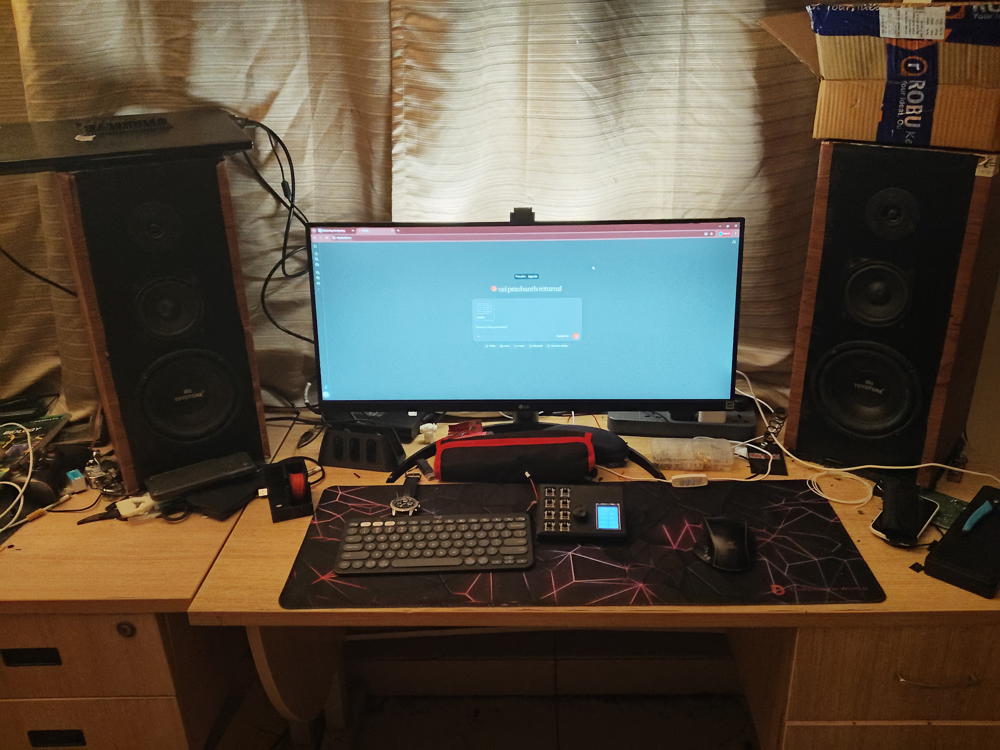
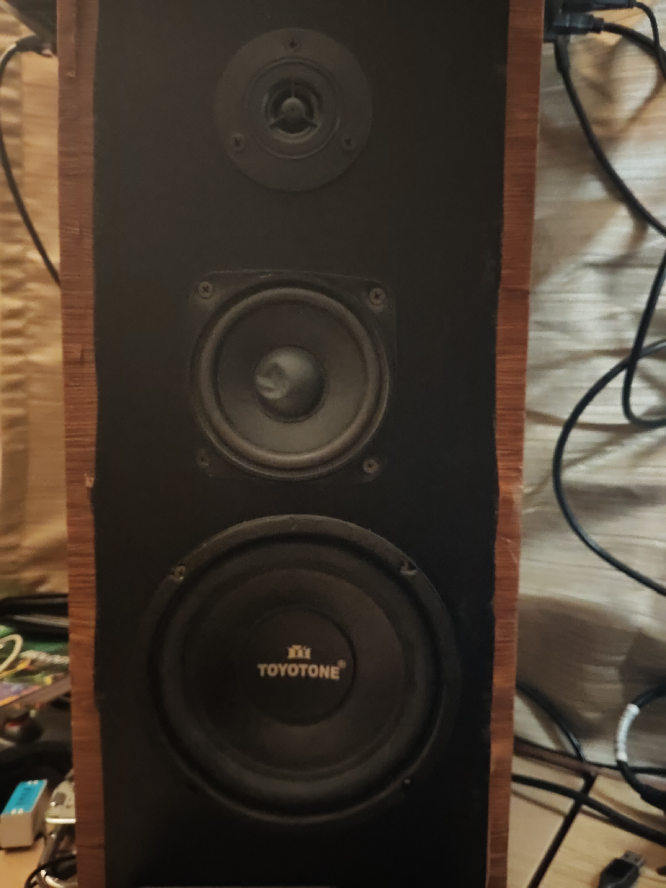
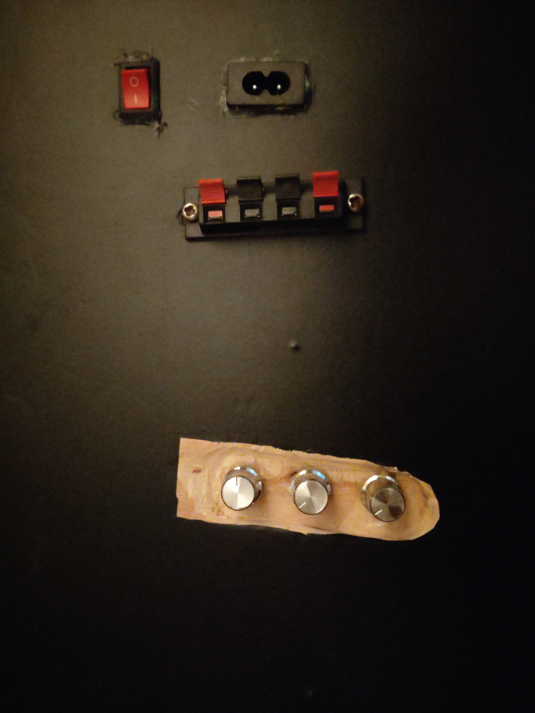
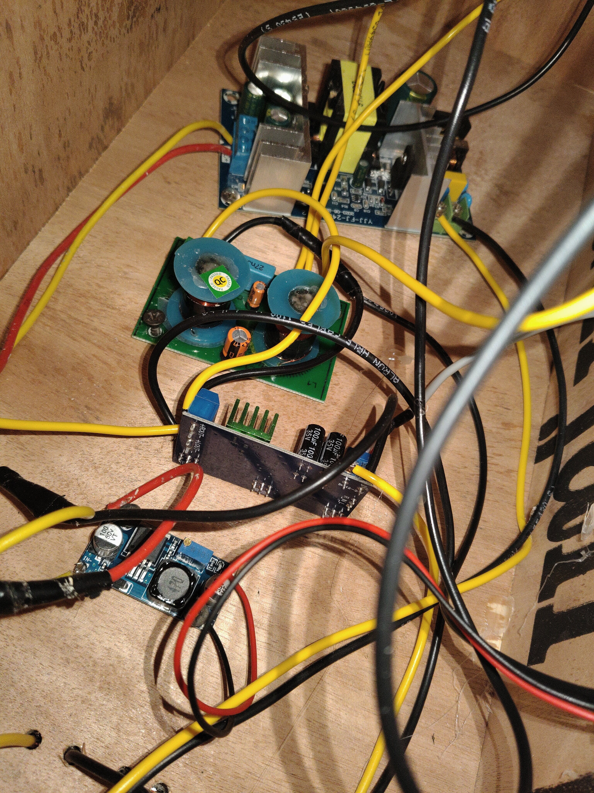
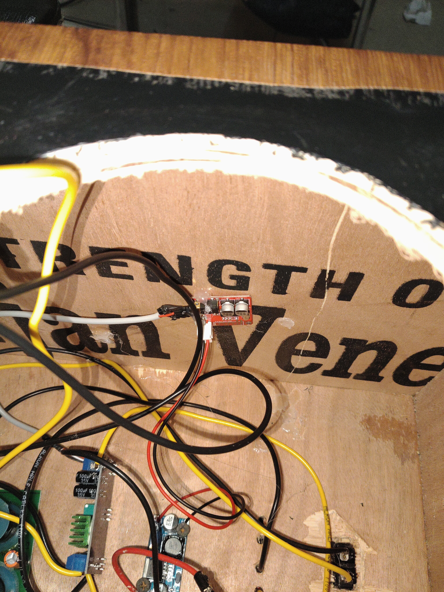
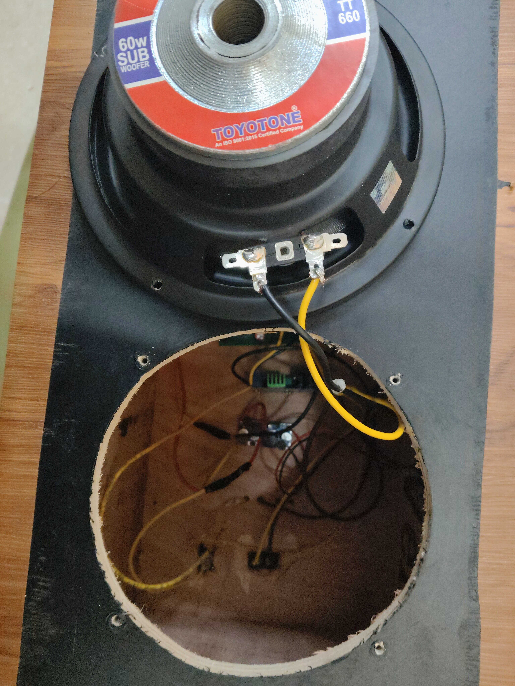

# 🔊 Custom 3-Way Audiophile Studio Monitors

> A fully custom-designed and hand-built stereo pair of high-power 3-way near-field studio monitors, capable of filling large rooms and lecture halls with clean, high-fidelity audio.

---

## 🚀 Overview

This project documents the complete design, build, and tuning of a **custom 3-way active speaker system** built from scratch — individually amplified driver stages, a passive crossover network, Bluetooth input, and custom EQ tuning.

Each speaker in the stereo pair is a **self-contained, fully active 3-way monitor** with its own:
- Internal amplification per driver
- Passive crossover for frequency routing
- Dedicated volume control per driver band
- Mains-powered operation (2-pin AC)
- Bluetooth input at 48kHz / 24-bit

This is **not** a kit build. Every stage — enclosure construction, wiring, crossover integration, and EQ tuning — was designed and assembled by hand.

---

## 🔊 Speaker Configuration (Per Channel)

| Driver | Size | Power | Role |
|--------|------|-------|------|
| Toyotone TT-660 Subwoofer | 6.5" | 60W | Low frequencies |
| Mid-woofer | ~4" | 20W | Midrange |
| Dome Tweeter | 1" | 30W | High frequencies |

- **Total power per channel**: ~110W (tri-amplified)
- **System**: 2.0 Stereo — each speaker handles full frequency range independently
- **Architecture**: True 3-way — each driver operates in its own frequency band

---

## ⚡ System Architecture

```
Bluetooth Input (48kHz / 24-bit)
    │
    ├──► [Amp Module - Sub]    ──► Passive Crossover ──► 6.5" Subwoofer
    ├──► [Amp Module - Mid]    ──► Passive Crossover ──► Mid-woofer
    └──► [Amp Module - Tweet]  ──► Passive Crossover ──► 1" Tweeter
              │
    [Per-driver Volume Knobs — Back Panel]
```

The passive crossover (toroidal inductors + electrolytic capacitors) handles frequency band separation after amplification, ensuring a clean handoff between drivers.

---

## 🔌 Connectivity & Power

| Feature | Status |
|---------|--------|
| Bluetooth | ✅ Active — 48kHz / 24-bit |
| AUX input (L/R) | 🔜 Planned |
| Onboard DSP (ESP32) | 🔜 Planned |
| Power | 2-pin AC mains |

---

## 📦 Enclosure Design

- **Material**: Custom-built wood with veneer finish
- **Type**: Sealed (closed-box)
- **Low frequency extension**: ~35 Hz
- **Scale**: Sufficient SPL for large rooms and lecture halls
- **Internal layout**: All amp boards and crossover mounted internally — clean external appearance

### Notes
- Sealed design chosen for tighter, more accurate bass vs. ported
- Wood construction minimises panel resonance
- All wiring and electronics fully internal

---

## 🎛️ Back Panel (Per Speaker)

- **2-pin AC socket** — direct mains power input
- **Illuminated rocker switch** — power on/off
- **4-terminal speaker binding posts**
- **3× volume potentiometers** — individual level trim per driver (sub / mid / tweet) on custom wood bracket

Per-driver level trim is a feature typically found only in professional studio monitors.

---

## 🔧 Internal Electronics

| Component | Role |
|-----------|------|
| Class-D amp modules (×3) | Per-driver amplification |
| Passive crossover PCB | Frequency routing via toroidal inductors + capacitors |
| DC-DC converter module | Regulated voltage for lower-power stages |
| 100µF 35V filter capacitors | Power supply smoothing |
| Bluetooth receiver module | 48kHz/24-bit wireless input |

---

## 🎛️ EQ Tuning

Tuned using **Peace Equalizer (APO-based)** — preset included at [`eq/tight-bass.peace`](eq/tight-bass.peace).

See [`eq/README.md`](eq/README.md) for full filter-by-filter breakdown and loading instructions.

### Global Settings

| Parameter | Value | Effect |
|-----------|-------|--------|
| PreAmp | -5 dB | Headroom to prevent clipping at high volume |
| Stereo Expanding | +3.5 | Widens soundstage beyond physical speaker placement |
| Stereo Shift | -2.047 | Fine corrects imaging balance between L/R |

### Tuning Goals
- Extended low-end (~35 Hz) without distortion
- Flat, accurate midrange
- Controlled highs without harshness
- Consistent output at lecture-hall SPL

---

## 📸 Gallery

### Full Setup


### Front Face — 3-Way Driver Layout


### Back Panel — Controls & Connectivity


### Internal — Electronics & Crossover


### Internal — Woofer Bay


### Driver — Toyotone TT-660 Sub


---

## 📊 Performance Summary

| Metric | Value |
|--------|-------|
| Frequency range | ~35 Hz – 20 kHz |
| Power per channel | ~110W |
| Configuration | 2.0 Stereo, 3-way per channel |
| Wireless input | Bluetooth 48kHz/24-bit |
| Suitable for | Large rooms, lecture halls |
| Tuning | Peace EQ (software) + per-driver trim (hardware) |

---

## 🛠️ Build Highlights

- Entire enclosure hand-built from wood
- All electronics sourced, integrated, and wired from scratch
- Custom back panel with 3-band per-driver level trim
- Passive crossover assembled with discrete toroidal inductors and filter capacitors
- Iterative EQ tuning across multiple listening sessions

---

## 🔗 Future Improvements

- [ ] **AUX input** — L/R line-level via 3.5mm or RCA
- [ ] **ESP32 onboard DSP** — parametric EQ running directly on the speaker, eliminating dependence on source-side software EQ; enables per-speaker tuning profiles independent of source device
- [ ] REW-based measurement and correction EQ
- [ ] DSP-based active crossover for better phase control
- [ ] Cleaner internal cable management and PCB mounting

---

## 🔗 Related Projects

- **[Custom Macropad](https://github.com/saiprashanth802/ESP32-BLE-Macropad.git)** — dedicated system control peripheral, visible in setup photo

---

## 🙌 Author

Built and documented by **[Your Name]**
Electronics & Audio Engineering Enthusiast
